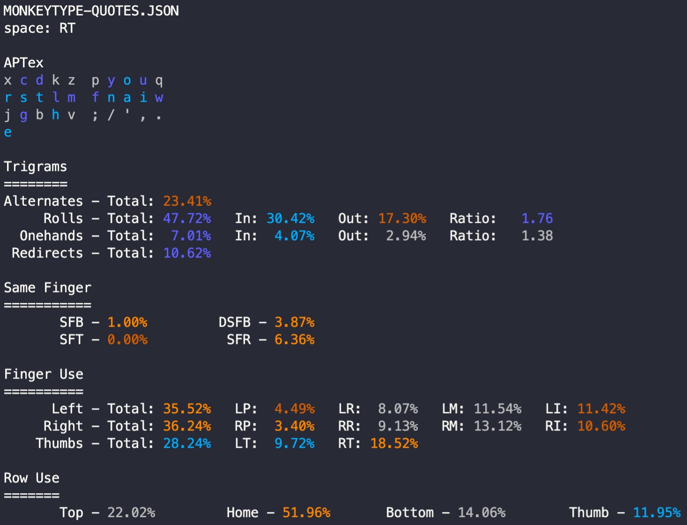

# APTex

## Layout

```text
/ w g d b  j f o u ;
r s t h v  y n a i l
x c m k q  z p ' , .
           e
```

## Description

APTex is an evolution of the [APT](https://github.com/Apsu/APT) layout, and improves on it by moving the `e` key out of the 3x10 grid and onto the  thumb, opposite of the thumb used for space.

This allows for collapsing some of the right hand inward, making the punctuation better, and moving letters like `q` and `w` and `j` to fix some of the SFBs and awkward sequences present.

The other major change is moving `l` to the other hand. Since `r` and `l` serve similar roles in how they combine with other letters this helps spread that load.

## Analysis



```text
APTex
/ w g d b  j f o u ; 
r s t h v  y n a i l 
x c m k q  z p ' , . e 
Rolls (l): 18.49%
        Inward: ~16.40%
        Outward: ~2.09%
Rolls (r): 32.01%
        Inward: ~20.96%
        Outward: ~11.05%
Inward Rolls: ~37.36%
Outward Rolls: ~13.14%
Total Rolls: ~50.50%
Alternates: ~33.01%
Onehands: ~4.35%
Redirects: ~6.11%
Finger Speed (weighted): [0.19 1.52 1.26 1.22 1.48 1.18 1.22 0.57 0.00 0.15]
Finger Speed (unweighted): [0.28 5.45 6.06 6.70 8.17 5.65 4.39 0.85 0.00 0.15]
Highest Speed (weighted): 1.52 (LR)
Highest Speed (unweighted): 8.17 (RI)
Index Usage: 11.7% 13.2%
SFBs: 0.727%
DSFBs: 5.130%
LSBs: 0.87%
Top SFBs:
        sc 0.138%       ny 0.119%       ui 0.107%       oa 0.075%
        nf 0.060%       ws 0.042%       l. 0.042%       sw 0.030%

Worst Bigrams:
        sc 14.486       oa 11.602       ui 11.503       tm 7.609
        l. 7.235        yn 6.607        gm 6.358        ws 5.742
```
