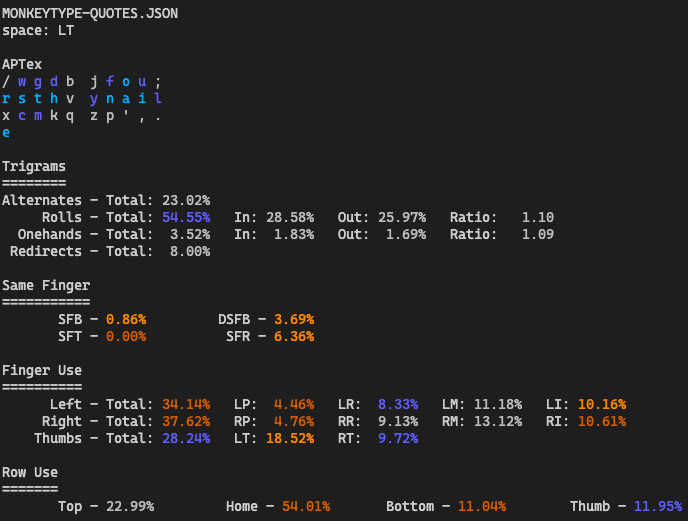

# APTex

## Layout

```text
x c d k z  p y o u q
r s t l m  f n a i w
j g b h v  ; / ' , .
        e
```

## Description

APTex is an evolution of the [APT](https://github.com/Apsu/APT) layout, and improves on it by moving the `e` key out of the 3x10 grid and onto the left thumb, opposite of the thumb used for space.

This allows for collapsing some of the right hand inward, making the punctuation better, and moving letters like `q` and `w` and `j` to fix some of the SFBs and awkward sequences present.

## Analysis



```text
APTex
x c d k z  p y o u q 
r s t l m  f n a i w 
j g b h v  e ; / ' , . 
Rolls (l): 19.27%
        Inward: ~16.42%
        Outward: ~2.85%
Rolls (r): 30.61%
        Inward: ~21.80%
        Outward: ~8.82%
Alternates: ~36.13%
Onehands: ~3.06%
Redirects: ~4.79%
Finger Speed (weighted): [0.20 1.59 1.01 1.97 1.73 1.34 1.03 0.10 0.04 0.00]
Finger Speed (unweighted): [0.31 5.74 4.86 10.85 8.65 6.70 5.67 0.49 0.15 0.00]
Highest Speed (weighted): 1.97 (LI)
Highest Speed (unweighted): 10.85 (LI)
Index Usage: 13.1% 13.1%
SFBs: 0.747%
DSFBs: 5.479%
LSBs: 2.27%
Top SFBs:
        sc 0.138%       ny 0.119%       ui 0.107%       oa 0.075%
        gs 0.061%       nf 0.060%       lv 0.027%       lk 0.026%

Worst Bigrams:
        cs 14.486       oa 11.138       pn 8.586        ui 7.529
        o' 7.206        lv 6.527        dt 6.037        sg 5.899
```